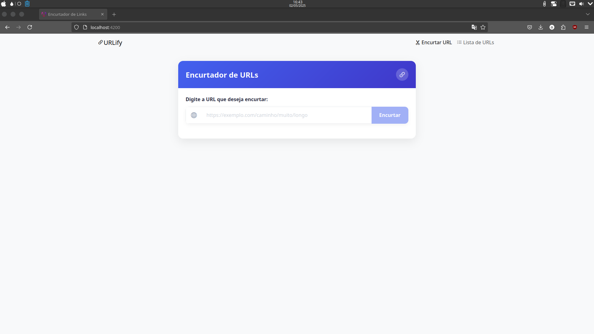
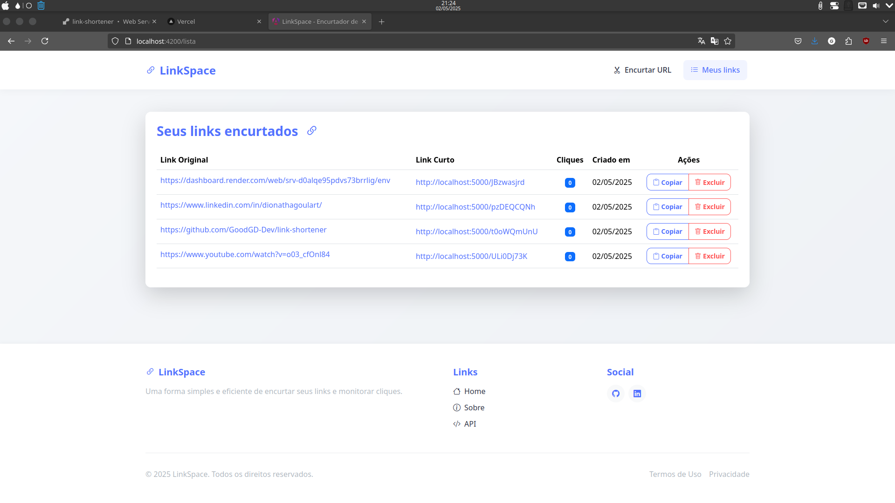
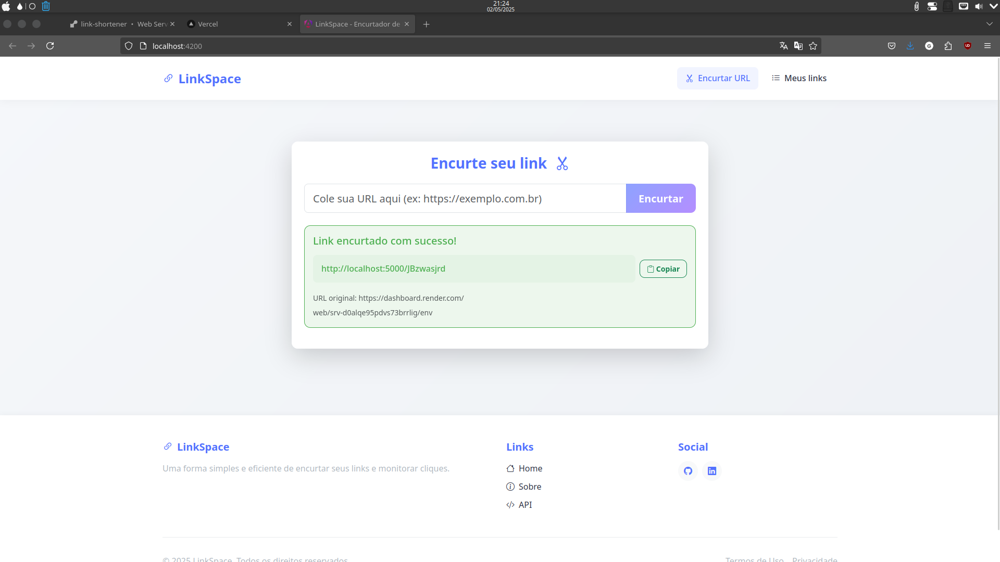

# 🔗 Encurtador de Links - Projeto Fullstack

Um aplicativo completo para encurtar URLs longas em links curtos e fáceis de compartilhar, com interface moderna e intuitiva.



## 📋 Índice

- [Visão Geral](#-visão-geral)
- [Funcionalidades](#-funcionalidades)
- [Tecnologias Utilizadas](#️-tecnologias-utilizadas)
- [Estrutura do Projeto](#-estrutura-do-projeto)
- [Instalação e Execução](#-instalação-e-execução)
- [Demonstração](#-demonstração)
- [Como Contribuir](#-como-contribuir)
- [Licença](#-licença)

## 🔍 Visão Geral

Este projeto é um encurtador de URLs fullstack desenvolvido com Node.js no backend e Angular no frontend. O sistema permite que usuários transformem URLs longas em links curtos e fáceis de compartilhar, além de fornecer estatísticas de acesso a cada link.



## ✨ Funcionalidades

- **Encurtamento de URLs:** Transforme links longos em URLs curtas e amigáveis
- **Cópia para Área de Transferência:** Botão para copiar o link encurtado com um clique
- **Estatísticas de Cliques:** Acompanhe quantas vezes cada link foi acessado
- **Listagem de URLs:** Visualize todas as URLs encurtadas em uma tabela organizada
- **Design Responsivo:** Interface adaptável para desktops, tablets e smartphones
- **Validação de URLs:** Sistema inteligente que valida URLs antes de processá-las
- **Redirecionamento Automático:** Redirecionamento rápido da URL curta para a original



## 🛠️ Tecnologias Utilizadas

### Backend
- **Node.js:** Ambiente de execução JavaScript server-side
- **Express:** Framework web para Node.js
- **MongoDB:** Banco de dados NoSQL para armazenamento das URLs
- **Mongoose:** ODM (Object Data Modeling) para MongoDB
- **ShortID:** Biblioteca para geração de IDs curtos e únicos
- **Valid-URL:** Biblioteca para validação de URLs

### Frontend
- **Angular 14+:** Framework front-end baseado em TypeScript
- **TypeScript:** Linguagem de programação tipada baseada em JavaScript
- **SASS:** Pré-processador CSS para estilização avançada
- **Bootstrap 5:** Framework CSS para design responsivo
- **Bootstrap Icons:** Conjunto de ícones para interface de usuário

## 📁 Estrutura do Projeto

### Backend
```
backend/
├── models/           # Modelos de dados para MongoDB
│   └── url.js        # Modelo para armazenamento de URLs
├── routes/           # Definição das rotas da API
│   └── urls.js       # Rotas para gerenciamento de URLs
├── config/           # Configurações do aplicativo
│   └── db.js         # Configuração de conexão com o MongoDB
├── package.json      # Dependências do projeto
└── server.js         # Ponto de entrada do servidor
```

### Frontend
```
frontend/
├── src/
│   ├── app/
│   │   ├── components/           # Componentes Angular
│   │   │   ├── url-shortener/    # Componente de encurtamento
│   │   │   └── url-list/         # Componente de listagem
│   │   ├── services/             # Serviços para comunicação com API
│   │   │   └── url.service.ts    # Serviço para gestão de URLs
│   │   ├── models/               # Interfaces e modelos de dados
│   │   │   └── url.model.ts      # Interface para objetos de URL
│   │   └── app.module.ts         # Configuração do módulo principal
│   └── styles.scss               # Estilos globais da aplicação
└── angular.json                  # Configuração do Angular
```

## 🚀 Instalação e Execução

### Pré-requisitos
- Node.js (versão 14 ou superior)
- NPM ou Yarn
- MongoDB (local ou remoto)
- Angular CLI

### Configuração do Backend
1. Clone o repositório:
   ```bash
   git clone https://seu-repositorio/encurtador-links.git
   cd encurtador-links/backend
   ```

2. Instale as dependências:
   ```bash
   npm install
   ```

3. Crie um arquivo `.env` na raiz do diretório `backend` com as seguintes variáveis:
   ```
   MONGO_URI=sua_conexao_mongodb
   BASE_URL=http://localhost:5000
   PORT=5000
   ```

4. Inicie o servidor:
   ```bash
   npm start
   ```

### Configuração do Frontend
1. Navegue até o diretório do frontend:
   ```bash
   cd ../frontend
   ```

2. Instale as dependências:
   ```bash
   npm install
   ```

3. Inicie o servidor de desenvolvimento:
   ```bash
   npm start
   ```

4. Acesse o aplicativo em `http://localhost:4200`

## 📊 Demonstração

### Encurtando uma URL
1. Acesse a página inicial
2. Insira uma URL longa no campo de texto
3. Clique no botão "Encurtar"
4. Copie a URL encurtada gerada

### Visualizando estatísticas
1. Acesse a página "Listar URLs" através do menu de navegação
2. Visualize todas as URLs encurtadas com suas estatísticas
3. Use o botão "Copiar" para copiar qualquer URL da lista


Desenvolvido por [GoodGD](https://www.linkedin.com/in/dionathagoulart/)
