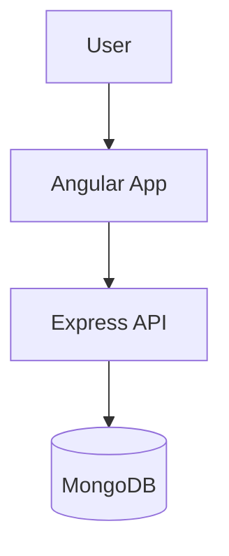

<div align="center">

# LINKSPACE
### URL SHORTENER


<br />

**Plataforma moderna de encurtamento de URLs com analytics em tempo real.**
**Interface intuitiva e dashboard completo para gerenciamento de links.**

[Getting Started](#-getting-started) • [License](#-license)

</div>

---

## 🏗️ Architecture

Fullstack application with **Angular** frontend and **Node.js/Express** backend.



---

## 🚀 Applications

<div align="center">

| Application | Description | Tech Stack |
|:-----------:|:----------- |:---------- |
| **Frontend** | User dashboard and link management. | `Angular` `Bootstrap` `TypeScript` |
| **Backend** | API for link generation and analytics. | `Node.js` `Express` `MongoDB` |

</div>

---

## 🛠️ Getting Started

### Prerequisites

*   **Node.js 18+**
*   **MongoDB**

### Installation

```bash
# 1. Clone the repository
git clone https://github.com/DionathaGoulart/link-shortener--Angular.git

# 2. Setup Backend
cd backend
npm install
npm start

# 3. Setup Frontend (in a new terminal)
cd ../frontend
npm install
npm start
```

---

## 📄 License

This project is proprietary and confidential.

**Copyright © 2026 Dionatha Goulart.**
All Rights Reserved.
